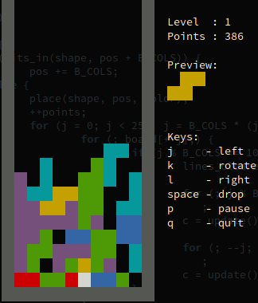

Micro Tetris™
=============

Micro Tetris™ — one of the smallest Tetris implementations in the world!
Utilizing only ANSI escape sequences to draw the board, no external
library dependencies other than a standard C library, like [uClibc][] or
[musl libc][]. Hence, very suitable for embedded devices in need of an
easter egg ;-)

Issue tracker and GIT repository available at GitHub:

  * [Repository][]
  * [Issue Tracker][]
  * [Docker Image](https://ghcr.io/troglobit/tetris)
  * [tetris-1.4.0.tar.gz][tarball], [MD5][], [SHA256][]


Docker Image
------------

Pre-built Docker images are available from [ghcr.io][] as of the v1.4.0
release.  Previous releases available on <https://hub.dockercom>.  The
[GIT repository][repository] has a `Dockerfile` for building your own
image from the source tree:

```shell
cd tetris/
docker build -t troglobit:tetris .
.
.
.
docker run -ti troglobit:tetris
```

> These instructions assume you already have [docker.io][] installed.


Origin & References
-------------------

The game is based on a 1989 *International Obfuscated C Code Contest*
([IOCCC](http://www.ioccc.org)) entry made by [John Tromp][].  See
John's home page for the source code http://tromp.github.io/tetris.html

This human-readable "clone" is maintained by [Joachim Wiberg][].

[uClibc]:          https://uclibc-ng.org
[ghcr.io]:         https://github.com/troglobit/tetris/pkgs/container/tetris/
[musl libc]:       https://www.musl-libc.org
[docker.io]:       https://www.docker.com
[John Tromp]:      https://tromp.github.io/
[Repository]:      https://github.com/troglobit/tetris
[Issue Tracker]:   https://github.com/troglobit/tetris/issues
[Joachim Wiberg]:  https://troglobit.com
[tarball]:         https://ftp.troglobit.com/tetris/tetris-1.4.0.tar.gz
[MD5]:             https://ftp.troglobit.com/tetris/tetris-1.4.0.tar.gz.md5
[SHA256]:          https://ftp.troglobit.com/tetris/tetris-1.4.0.tar.gz.sha256
