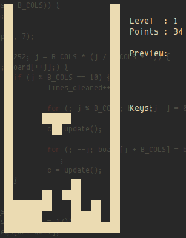

Micro Tetris™
=============



Micro Tetris™ — one of the smallest Tetris implementations in the world!
Utilizing only ANSI escape sequences to draw the board, no external
library dependencies other than a standard C library, like [uClibc] or
[musl libc]. Hence, very suitable for embedded devices in need of an
easter egg ;-)

Issue tracker and GIT repository available at GitHub:

* [Repository]
* [Issue Tracker]
* [tetris-1.2.1.tar.bz2][tarball], [MD5][hashfile]


Docker Image
------------

The [GIT repository][repository] has a `Dockerfile` for building a
Docker image.  Simply check out the GIT sources and:

```shell
cd tetris/
docker build -t troglobit:tetris .
.
.
.
docker run -ti troglobit:tetris
```

These instructions assume you already have [docker.io][] installed.

Origin & References
-------------------

The game is based on a 1989 *International Obfuscated C Code Contest*
([IOCCC](http://www.ioccc.org)) entry made by [John Tromp].  See John's
home page for the source code http://tromp.github.io/tetris.html

This human-readable "clone" is maintained by [Joachim Nilsson].

[uClibc]:          http://uclibc.org
[musl libc]:       http://musl-libc.org
[docker.io]:       https://www.docker.com
[John Tromp]:      http://tromp.github.io/
[Repository]:      http://github.com/troglobit/tetris
[Issue Tracker]:   http://github.com/troglobit/tetris/issues
[Joachim Nilsson]: http://troglobit.com
[tarball]:         http://troglobit.com/tetris/tetris-1.2.1.tar.bz2
[hashfile]:        http://troglobit.com/tetris/tetris-1.2.1.tar.bz2.md5

